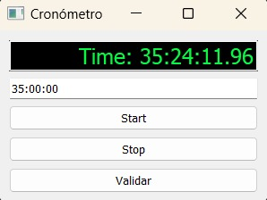

<h1 align = "center"> Cronómetro personalizado  </h1>

 Al tener la necesidad de cronometrar muchas horas de trabajo, me vi en la necesidad de crear un cronómetro configurable, ya que no encontré en ninguna parte
un cronómetro en donde se puedira configurar la hora de inicio.  Todo fue realizado con la librería PyQt6. Además creé un ejecutable .exe para correr la aplicación, el archivo es cronometro_PyQt6.ese, el cual
crea una App Desktop. Cualquiera puede descargarlo e instalarlo.
  
### Instrucciones:

* Descarga el .exe
*  Abre la carpeta donde se descargó y ejecutalo.
*  Establece la hora de inicialización en formato 00:00:00, horas, minutos y segundos, en la casilla en blanco. (Podrás realizar este paso en cada sesión, es lo que lo hace único.)
*  Valida la hora inicializada con el botón "Validar"
*  Oprime Start para comenzar. 

### Nota: Continuaré este proyecto en el futuro. Añadiré una pestaña en donde se guarde el tiempo cronometrado por día. También haré una MovileAPP que se concte con la de escritorio.

 

## Realizado con:

 

 

### Gerardo Huerta: [Linkedin](https://www.linkedin.com/in/j-gerardo-huerta-escobar-b6516124b/) | [GitHub](https://github.com/Gerardo-Huerta-Esc) 
